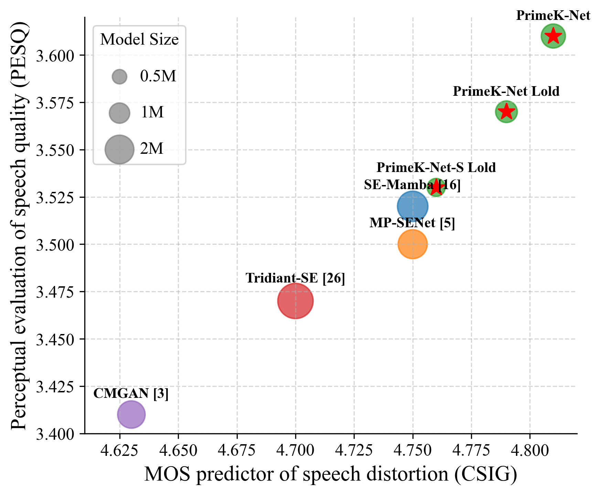

# PrimeK-Net: Multi-scale Spectral Learning via Group Prime-Kernel Convolutional Neural Networks for Single Channel Speech Enhancement
### Zizhen Lin, Junyu Wang, Ruili Li, Fei Shen, Xi Xuan
In our [paper](https://arxiv.org/abs/2502.19906), we proposed PrimeK-Net.

**Abstract:** 
Single-channel speech enhancement is a challenging ill-posed problem focused on estimating clean speech from degraded signals. Existing studies have demonstrated the competitive performance of combining convolutional neural networks (CNNs) with Transformers in speech enhancement tasks. However, existing frameworks have not sufficiently addressed computational efficiency and have overlooked the natural multi-scale distribution of the spectrum. Additionally, the potential of CNNs in speech enhancement has yet to be fully realized. To address these issues, this study proposes a Deep Separable Dilated Dense Block (DSDDB) and a Group Prime Kernel Feedforward Channel Attention (GPFCA) module. Specifically, the DSDDB introduces higher parameter and computational efficiency to the Encoder/Decoder of existing frameworks. The GPFCA module replaces the position of the Conformer, extracting deep temporal and frequency features of the spectrum with linear complexity. The GPFCA leverages the proposed Group Prime Kernel Feedforward Network (GPFN) to integrate multi-granularity long-range, medium-range, and short-range receptive fields, while utilizing the properties of prime numbers to avoid periodic overlap effects. Experimental results demonstrate that PrimeK-Net, proposed in this study, achieves state-of-the-art (SOTA) performance on the VoiceBank+Demand dataset, reaching a PESQ score of 3.61 with only 1.41M parameters.

This source code is for the PrimeK-Net accepted by ICASSP 2025.

## Pre-requisites
1. Python >= 3.6.
2. Clone this repository.
3. Install python requirements. Please refer [requirements.txt](https://github.com/yxlu-0102/MP-SENet/blob/main/requirements.txt).
4. Download and extract the [VoiceBank+DEMAND dataset](https://datashare.ed.ac.uk/handle/10283/1942). Use downsampling.py to resample all wav files to 16kHz, 
```
python downsampling.py
```
5. move the clean and noisy wavs to `VoiceBank+DEMAND/wavs_clean` and `VoiceBank+DEMAND/wavs_noisy` or any path you want, and change the path in train.py [parser.add_argument('--input_clean_wavs_dir', default=], respectively. Notably, different downsampling ways could lead to different result. 

## Training
For single GPU (Recommend), PrimeK-Net needs at least 16GB GPU memery.
```
python train.py --config config.json
```

## Training with your own data

Edit path in make_file_list.py and run

```
python make_file_list.py
```
Then replace the test.txt and training.txt with generated files in folder ./VoiceBank+DEMAND and put your train and test set in the same folder(clean, noisy).

## Inference
```
python inference_and_cal_metric.py --checkpoint_file=/path/g_xxxx

```

You can also use the pretrained best checkpoint file we provide in `ckpt/g_best`.<br>
Generated wav files are saved in `generated_files` by default.<br>
You can change the path by adding `--output_dir` option.

## Model Structure


## Comparison with other SE models


## Acknowledgements
We referred to [MP-SENet](https://github.com/yxlu-0102/MP-SENet)
